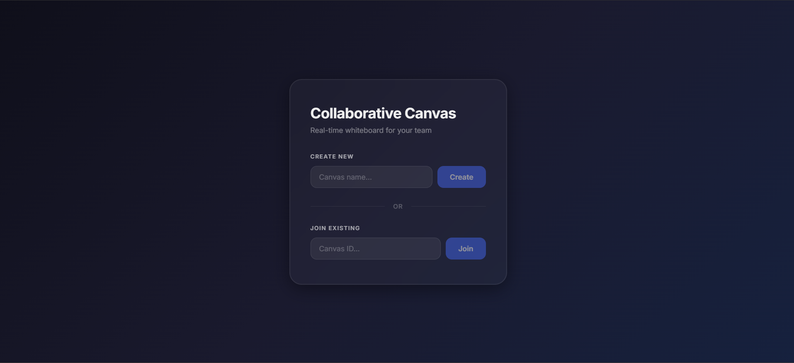
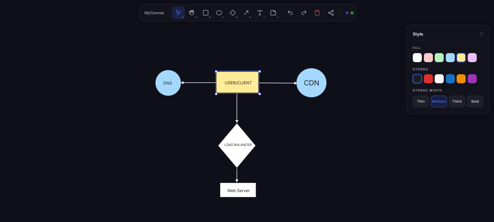

# Collaborative Canvas

A real-time collaborative whiteboard. Multiple people open the same canvas in different
browsers and draw, move, resize, and delete shapes, edit text, undo/redo, and see each
other's changes live.

**Backend:** Spring Boot 4 (Java 21) · raw WebSocket + REST · PostgreSQL (Spring Data JPA) · Kafka
**Frontend:** React 19 + TypeScript · Vite · Zustand

---

## Demo

A 23-second walkthrough of the whiteboard in action — join a canvas, draw, watch a peer's edit
land live, and share the link:

<video src="docs/demo/collaborative-canvas-brag.mp4" poster="docs/demo/collaborative-canvas-brag.jpg" controls muted loop width="100%"></video>

[Open the demo video (MP4)](docs/demo/collaborative-canvas-brag.mp4)

## Screenshots

### Landing / join screen



Create a new canvas by name, or join an existing one with its ID. Sharing a canvas is just a
link — opening it auto-joins and keeps the canvas ID in the URL.

### Canvas editor



The editor: a hand-rolled SVG canvas with shapes (rectangle, ellipse, diamond, line, arrow, text,
sticky note), a drag-to-pan **Grab** tool, freeform **arrow rotation**, and a draggable **Style**
panel for fill, stroke, stroke width, and text color. Selected objects show resize/rotate handles.

---

## Features

- **Real-time collaboration** over a single WebSocket per client, with optimistic UI reconciled
  against the server broadcast.
- **Shapes:** rectangle, ellipse, diamond, line, arrow, text, sticky note.
- **Interactions:** draw, select, move, resize (with text scaling), rotate arrows, double-click to
  edit text, pan/zoom, drag-to-pan grab tool.
- **Styling:** paired fill/stroke palette, stroke width, and customizable text color.
- **Undo / redo** (`Ctrl/Cmd+Z`, `Ctrl/Cmd+Shift+Z`), per client.
- **Durable state** in PostgreSQL; **durable operation log** in Kafka.
- **Shareable canvas links** (`?canvas=<id>`) with auto-join.

---

## Architecture

```
                 ┌────────────────── Browser (React SPA) ──────────────────┐
                 │   Zustand store: objects, viewport, peers, selection      │
                 └───────────┬──────────────────────────────┬───────────────┘
                   REST /api/canvases              WebSocket /ws/canvas/{id}
                             │                              │
                             ▼                              ▼
                     CanvasController             CanvasWebSocketHandler
                             │                    ├─ CanvasService (memory + JPA)
                             │                    ├─ CanvasHistory (undo/redo)
                             │                    └─ CanvasOperationProducer
                             ▼                              │
                       CanvasService ──────► PostgreSQL      ▼
                     (source of truth)   canvases   Kafka: canvas-operations
                                         canvas_objects      │
                                                             ▼
                                              Consumer → canvas_operations (jsonb)
```

- **Control plane:** REST creates a canvas and returns its metadata.
- **Data plane:** the WebSocket carries all live mutations, presence, and undo/redo.
- **`canvas_objects` is the source of truth**; Kafka is a side-channel audit/replay log (not event
  sourcing — the canvas is never rebuilt from it).

---

## Tech stack

| Layer | Technology |
|---|---|
| Backend | Spring Boot 4.1, Java 21, Spring WebSocket, Spring Data JPA, Lombok |
| Data | PostgreSQL 16, Kafka 4 (KRaft) |
| Frontend | React 19, TypeScript, Vite, Zustand, hand-rolled SVG |
| Tests | JUnit 5 + Mockito (backend), Vitest (frontend) |
| Deploy | Docker + Docker Compose, nginx, Let's Encrypt |

---

## Project structure

```
collaborative-canvas/            # Spring Boot backend
  src/main/java/.../canvas/       # REST controller
  src/main/java/.../websocket/    # handler, protocol types, undo/redo history
  src/main/java/.../service/      # CanvasService, Kafka producer/consumer
  src/main/java/.../model|persistence|repository/
  src/main/resources/             # application.properties, migrate-*.sql
frontend/                         # React + TypeScript client
  src/components/                 # CanvasSurface, Toolbar, StylePanel, ...
  src/store/canvasStore.ts        # Zustand store
  src/ws/websocketClient.ts       # reconnecting WebSocket client
deploy/README.md                  # single-VM deployment runbook
```

---

## Getting started (local)

**Prerequisites:** Java 21+, Node 20+, Docker.

1. **Start PostgreSQL + Kafka**
   ```bash
   cd collaborative-canvas
   echo "POSTGRES_PASSWORD=postgres" > .env
   docker compose up -d
   ```

2. **Run the backend** (defaults to `localhost:5432` and `localhost:9092`)
   ```bash
   cd collaborative-canvas
   ./mvnw spring-boot:run
   ```

3. **Run the frontend** (Vite proxies `/api` and `/ws` to `:8080`)
   ```bash
   cd frontend
   npm install
   npm run dev
   ```
   Open http://localhost:5173, create a canvas, and copy the share link.

### Configuration

The backend reads these environment variables (with local defaults):

| Variable | Default |
|---|---|
| `DATABASE_URL` | `jdbc:postgresql://localhost:5432/collaborative_canvas` |
| `DATABASE_USERNAME` / `DATABASE_PASSWORD` | `postgres` |
| `KAFKA_BOOTSTRAP_SERVERS` | `localhost:9092` |
| `WEBSOCKET_ALLOWED_ORIGINS` | local dev origins |

---

## WebSocket protocol

| Direction | Types |
|---|---|
| Client → server | `CREATE_OBJECT`, `MOVE_OBJECT`, `UPDATE_OBJECT`, `DELETE_OBJECT`, `UNDO`, `REDO`, `PRESENCE` |
| Server → client | `SYNC_STATE`, `OPERATION`, `CLIENT_JOINED`, `CLIENT_LEFT`, `PRESENCE`, `HISTORY_STATE`, `ERROR` |

Ordering is enforced with a server-assigned per-canvas sequence number; updates are per-operation
last-write-wins. All updates are sent as full object snapshots.

---

## Tests

```bash
cd collaborative-canvas && ./mvnw test   # backend
cd frontend && npm test                  # frontend
```

---

## Deployment

The app is deployed as a single self-managed VM: Docker Compose runs the backend, an nginx
container that serves the React build and reverse-proxies `/api` + `/ws`, self-hosted PostgreSQL
and Kafka (internal-only, no published ports), and certbot for TLS. See
[`deploy/README.md`](deploy/README.md) for the full runbook.

---

## Known limitations

- **Last-write-wins per operation**, not OT/CRDT — concurrent edits to the same object can clobber.
- **Kafka is an audit-only log** with no transactional outbox; a crash between the DB write and the
  publish can drop a log entry.
- **Undo/redo is per-client and in-memory**, scoped to the canvas room (not durable across restarts).
- **Delete does not compensate** the in-memory cache if the DB write fails (create/move/update do).
- **Single instance** — rooms, sequence numbers, and history are in memory.
- **Presence cursors** are supported by the server but not yet sent by the client.
- **No authentication** — a canvas UUID acts as a bearer token.

---

## License

No license specified.
